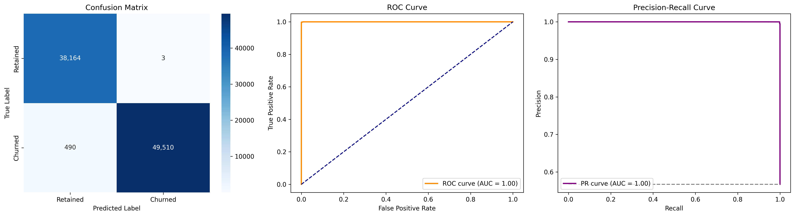
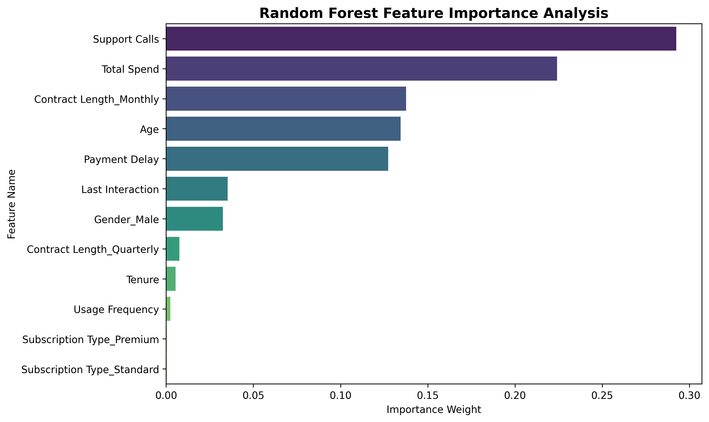

# End-to-End Predictive Customer Churn Classifier

An end-to-end Machine Learning classification pipeline built with Scikit-Learn to predict customer churn based on behavioral data. Trained on over 440,000 customer records, this project provides automated preprocessing, model evaluation, and business interpretability.

---

## 📊 Dataset Overview
* **Source Dataset:** [Google Drive Public Link](https://drive.google.com/file/d/1UiIqB9ea7WKgt0AIWQrwxWE6lJ96YbDz/view?usp=drive_link)
* **Dataset Size:** 440,833 rows, 12 features
* **Target Variable:** `Churn` (0 = Retained, 1 = Churned)

---

## 🛠️ Machine Learning Pipeline Architecture
1. **Automated Data Fetching:** Ingests dataset from public Google Drive storage via `gdown`.
2. **Preprocessing Pipeline (`ColumnTransformer`):**
   * **Numerical Features:** Median imputation + `StandardScaler`.
   * **Categorical Features:** Most-frequent imputation + `OneHotEncoder(drop='first')`.
3. **Classification Model:** `RandomForestClassifier` (100 estimators, max depth 12).
4. **Data Partitioning:** 80/20 Stratified Train-Test Split.

---

## 📈 Performance & Evaluation Metrics

| Metric Class | Precision | Recall | F1-Score | Support |
| :--- | :---: | :---: | :---: | :---: |
| **Retained (0)** | 0.99 | 1.00 | 0.99 | 38,167 |
| **Churned (1)** | 1.00 | 0.99 | 1.00 | 50,000 |
| **Overall Accuracy** | — | — | **0.99** | **88,167** |
| **ROC-AUC Score** | — | — | **1.0000** | — |

---

## 💡 Key Behavioral Insights & Business Drivers

* **Support Calls (29.2% Weight):** High support ticket volume is the strongest leading indicator of churn risk.
* **Total Spend (22.4% Weight):** Lower spending tiers show significantly higher likelihood of abandonment.
* **Monthly Contracts (13.8% Weight):** Non-committed month-to-month subscribers churn at higher rates than annual subscribers.
* **Payment Delays (12.7% Weight):** Frequent payment lags signal imminent service cancellation.

---

## 🚀 How to Run
1. Open `churn_prediction_notebook.ipynb` in Google Colab.
2. Execute all cells sequentially. The dataset will download automatically.
3. The trained model artifact `churn_model_pipeline.pkl` can be loaded using `joblib.load()`.
